# Happy Sauna 

Welcome to the official repository of Happy Sauna, a website dedicated to promoting wellness through sauna experiences. 
Our website provides users with detailed information on our sauna offerings, pricing plans, health benefits and the opportunity to contact us for more personalized services.

# Table of Contents
### [User Experience](#user-experience)
[Initial discussion](#initial-discussion)
[User Stories](#user-stories)
### [Design](#design)
[Colour Scheme](#colour-scheme)
[Typography](#typography)
[Imagery](#imagery)
### [Features](#features)
[Navigation](#navigation)
[Homepage](#home-page)
[Pricing Page](#pricing-page)
[Contact Form](#contact-form)
[Contact Form](#contact-form)
### [Technologies Used](#technologies-used)
[Frameworks and Libraries](#frameworks-libraries--programs-used)
[Deployment and Local Development](#deployment--local-development)
[Deployment](#deployment)
[Local Development](#local-development)
[How to Fork](#how-to-fork)
[How to Clone](#how-to-clone)
### [Testing](#testing)
[Known Bugs](#known-bugs)
[Testing User Stories](#testing-user-stories)
### [Credits](#credits)

# User Experience

## Initial Discussion
[Happy Sauna was created with a simple goal: to help people relax and enjoy the health benefits of sauna sessions. We noticed that everyone seems to be busy these days, and finding time to unwind is hard. That's why we made a website where people can learn about our saunas, see the prices, and book a session easily.

We built this site for anyone who wants to take a break from their busy life and look after their health. Whether you're new to saunas or you've been enjoying them for years, we want to make it simple for you to find the information you need and get started with us.

Our website is designed to be easy to use. We chose colors and pictures that make you feel calm and peaceful, just like our saunas. We also made sure you can find your way around the site without any hassle.]

### User Stories
- As a new visitor, I want to understand the benefits of using a sauna, so that I can decide if it's right for me.
- As a potential customer, I want to easily navigate through the pricing plans, so I can choose a plan that suits my needs.
- As a returning customer, I want to contact Happy Sauna to schedule my sessions or inquire about services.

## Design

### Colour Scheme
- The website uses a simple setup of black, white and grey which matches the luxurious feel of our saunas and fits with the different brown tones of the wood within the images

The palette was was chosen through testing. 
### Typography
The typography for the site is centered around the use of the "Poppins" font family. This font has been chosen for its modern and clean lines, which contribute to the overall aesthetic and readability of the site.

- Fallback: Sans-serif is specified as the fallback font to maintain a similar look in the event that Poppins cannot be loaded.

### Imagery
Imagery is carefully selected to showcase the saunas and provide the user with a sense of the quality that we try to provide

Sources: 
https://www.istockphoto.com/
https://pixabay.com/

## Features

The website is comprised of four pages, three of which are accessible from the navigation menu (home page, books page & contact us page). The fourth page is a 404 page which is shown once a user navigates to  a non existing link.

#### All Pages on the website have:

- The website features a dynamic top navigation bar that facilitates easy browsing. Adjacent to the bar on the left is the Happy Sauna Logo. On the right side of the bar, there are links to various sections of the website, including the homepage, benefits, pricing page, and a contact page. 

- On mobile devices, the traditional navigation links are replaced with a hamburger menu icon, providing a streamlined and familiar navigational experience for users. This design choice is aimed at maintaining a neat interface and ensuring a positive user experience across devices.

- A footer which contains social media icon links to Instagram and Facebook. In addition to the names, icons were used to keep the footer clean and because they are universally recognisable.

### Navigation
 The navigation feature is implemented as a header element containing a responsive navigation bar with links to various sections of the website.

- The navigation is wrapped in a <header> tag.
- It contains an unordered list with the class nav-bar that represents the navigation menu.
- A logo is placed as the first item in the navigation bar, which is also a link that can be set to redirect to the home page.
- The navigation items include links to the Home page, Pricing page, Benefits section, and the Contact Us page.
- The navigation bar is responsive, with a checkbox used to toggle a mobile-friendly menu.

Source: 
Was taken from the following video and slightly modified: https://www.youtube.com/watch?v=qzAAiKFfNLo

##### Dependencies
Requires FontAwesome for icons.

### Home Page
This outlines the structure and components of the homepage for "Happy Sauna". The homepage serves as the landing page and provides an overview of the services, benefits, and a glimpse into the sauna experience offered.

#### Structure
- Header: Contains the navigation bar with a logo, menu items, and a hamburger menu for responsive design.
- Banner: A fixed banner with a parallax effect showcasing the brand's message.
- Sauna Preview Section: Displays a selection of sauna images with "Learn More" buttons linking to the pricing page.
- Benefits Section: Details the health and wellness benefits of using saunas.
- Footer: Includes social media links for Instagram and Twitter.

### Pricing Page
The Pricing Page for "Happy Sauna" details the various subscription plans and provides exclusive video tours of the sauna facilities.

#### Structure

- Header: Includes the navigation bar with a logo and menu items, featuring a responsive hamburger menu.
- Banner: A fixed banner with a parallax effect and a motivational tagline.
- Video Showcases: Two video sections that autoplay on load, offering a virtual tour of the sauna environments.
- Pricing Section: Displays three different pricing plans - Basic, Premium, and Deluxe - with detailed information and a call-to-action button for each.

### Contact Form
This document provides details about the Contact Form feature implemented in the web application. The Contact Form is designed to collect user information such as name, email address, phone number, subscription preference, and additional information that the user may want to share.

- Collects user's first and last names, email, and phone number.
- Offers a dropdown for subscription options: Basic, Premium, Deluxe.
- Includes a text area for any additional user comments or information.
- Validates required fields on the client side.
- Submits the data to a "https://httpbin.org/" page upon completion.

#### Structure
- Header: Includes logo and a navigation bar with links to other pages, adaptable for mobile screens with a hamburger menu.
- Contact Form: Central feature of the page where users input their personal and contact information, select a subscription plan from a dropdown, provide additional comments in a text area, and submit the form.

## Accessibility
Throughout the development process, I have prioritized accessibility to make the website user-friendly for individuals with disabilities. This has been accomplished through the following measures:

- Implementing semantic HTML to enhance the site structure and context for assistive technologies.
- Adding meaningful alt attributes to images, ensuring content is conveyed even when the images cannot be seen.
- Including descriptive information for non-text content, such as videos, to aid screen reader users.
- Selecting color schemes that provide ample contrast, catering to users with visual impairments.
- Making navigation intuitive for screen reader users by indicating the active page within the menu structure.
reference all of the websites where you received 
- Adding active page in navigation links for page readers to recognize and relay the information back to the user

## Technologies Used

### Languages Used
- HTML5
- CSS3

### Frameworks, Libraries & Programs Used
- FontAwesome for icons
- Github - To save and store the files for the website.
- Google Fonts - To import the fonts used on the website.
- Google Dev Tools - To troubleshoot and test features, solve issues with responsiveness and styling.
- https://convertio.co/ to convert my images to webp

## Deployment & Local Development

#### Deployment
Github Pages was used to deploy the live website. The instructions to achieve this are below:

- Log in (or sign up) to Github.
- Find the repository for this project, AlexanderDisput/Project-1-Sauna.
- Click on the Settings link.
- Click on the Pages link in the left hand side navigation bar.
- In the Source section, choose main from the drop down select branch menu. Select Root from the drop down select folder menu.
- Click Save. Your live Github Pages site is now deployed at the URL shown.

### Local Development

#### How to Fork
How to Fork
To fork the Project-1-Sauna repository:

- Log in (or sign up) to Github.
- Go to the repository for this project, AlexanderDisput/Project-1-Sauna.
- Click the Fork button in the top right corner.

#### How to Clone
To clone the Bully-Book-Club repository:

- Log in (or sign up) to GitHub.
- Go to the repository for this project, AlexanderDisput/Project-1-Sauna.
- Click on the code button, select whether you would like to clone with HTTPS, SSH or GitHub CLI and copy the link shown.
- Open the terminal in your code editor and change the current working directory to the location you want to use for the cloned directory.
- Type 'git clone' into the terminal and then paste the link you copied in step 3. Press enter.

## Testing 

#### W3C Validator
The W3C validator was used to validate the HTML on all pages of the website. It was also used to validate CSS in the style.css file.

Index Page HTML
Pricing Page HTML
Contact Us Page HTML
404 Page HTML
style.css CSS

#### Lighthouse
I used Lighthouse to allow me to test the performance, accessibility, best practices and SEO of the website.

#### Index page
The results can be seen here: 

Suggestions: 
- converting the images to .webp 
- set fixed dimensions to images 

Solutions:
- converted images using https://convertio.co/
- set fixed image sizes to the images, but still receiving the error. Not sure if this is due to the height being auto. That being said, I left the height auto to make sure that they remain as responsive as possible 

#### Pricing page

The results can be seen here: 

Suggestions: 
- avoid enormous network payloads
- image elements do not have explicit width and height

Solutions:
- tried to host the videos online to reduce the payload, but encountered issues with the recommended videos within the embeded player and also less control over the video itself. As a result, I chose to host the video on github as performance is not a concern in this project
- unable to find out which image dimensions need to be fixed here as well

#### Contact Us page

The results can be seen here: 

Suggestions: 
- image elements do not have explicit width and height

Solution:
- No solution implemented as I cannot set a specific height and width to my background image. This would remove some of its flexibility

### Known Bugs

- On the index.html page you can see on desktop devices that are wider than 766px will show the first row of the benefits with their center moved slightly to the right. I was unable to find out how to solve this issue, using the same layout within HTML and only changing CSS. 

Possible solution: 
I believe that solving this issue would require me to make fundamental changes to the way the benefits sections are nested. I chose the current approach to make the responsiveness simpler and easier to control. In future I would leave each benefit on its own and not nest 2 together as that can create all kinds of issues

- On every page, when opening the navigation menu on mobile devices: 
It will expand the menu from top to bottom and at the same time push the content below farther down. 

Possible solution: 
I was unable to solve this. What I have tried is to set the position of the .list class to absolute, which made no difference since the absolute positioned elements do not care for other elements, but the parent they are relative to

### Testing User stories 

As a first-time visitor to a luxury sauna website, I want to experience a visually engaging and informative introduction to the products, so that I can understand the quality and variety of saunas available, and envision them in different settings.

#### Homepage First Impression

Upon entering the website, I should immediately notice a high-quality image or video of a luxury sauna, possibly in use, to capture my attention and set the tone for the luxury and quality of the product.

The homepage should have a clean, elegant design that aligns with the luxury branding of the saunas.

#### Parallax Scrolling Effect

As I scroll down, the website should utilize a parallax scrolling effect to create a dynamic, engaging experience.
This effect should be smooth and not disrupt the browsing experience or the loading time of the website.

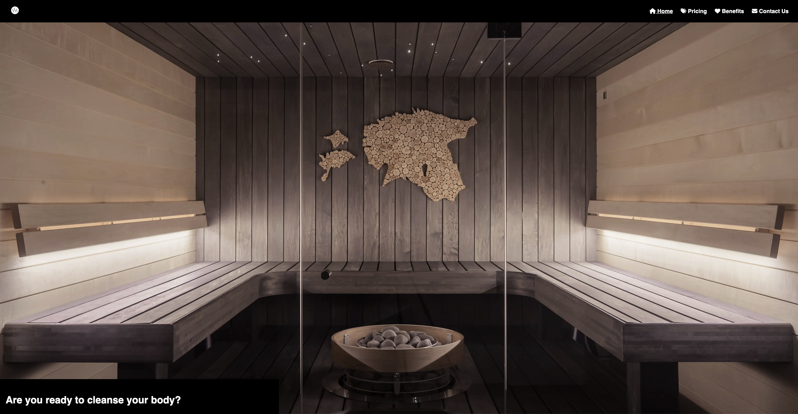

#### Sauna Preview and Information Accessibility

As a potential customer, I want to easily view and learn about different sauna models, so I can consider various options.
Each sauna model should be presented with a high-quality image.
The 'Learn More' buttons should be easily noticeable and lead to more detailed information.

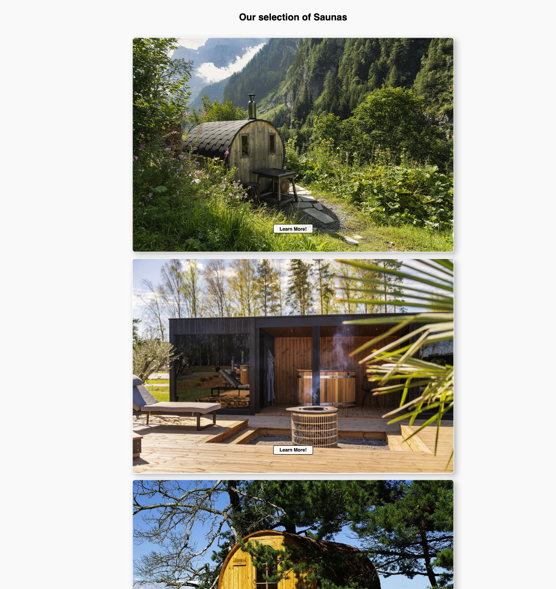
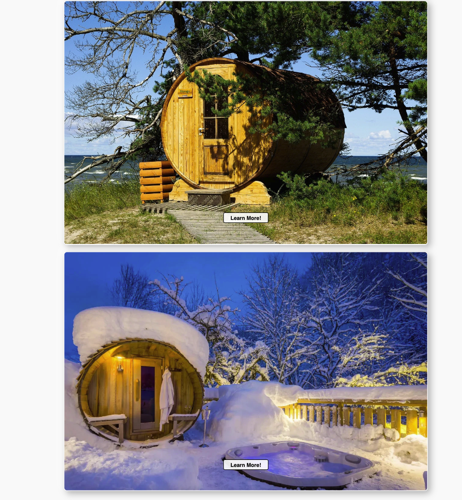

#### Benefits Section Clarity

As a visitor interested in sauna benefits, I want to easily find and understand the health and wellness benefits of using saunas.
The benefits section should be clearly segmented and informative.
Text should be legible with a user-friendly layout.

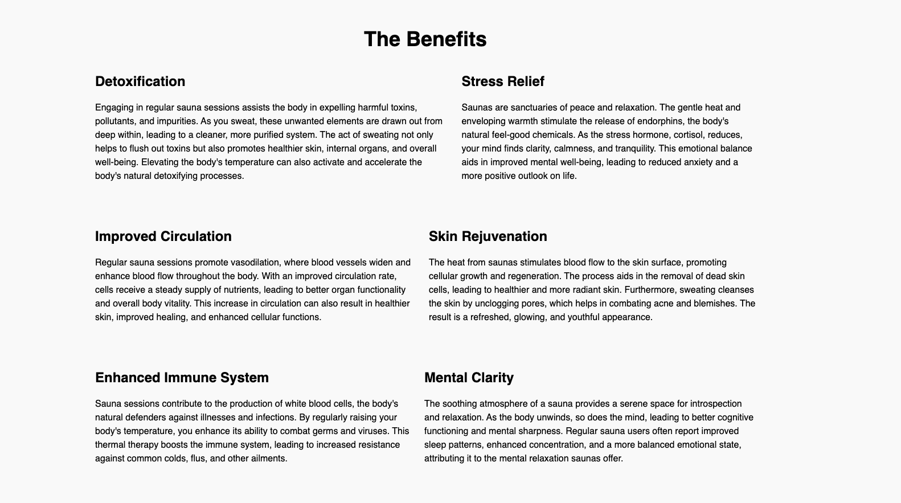

#### Footer and Social Media Accessibility

As a user interested in the brand's social presence, I want to easily find and access their social media links.

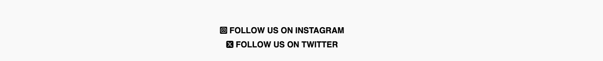

#### Responsive Navigation and Hamburger Icon Functionality

As a mobile user, I want to ensure that the navigation bar is responsive and the hamburger icon functions correctly, for a seamless browsing experience on smaller devices.

Upon clicking the hamburger icon, the navigation menu should expand and collapse smoothly, showing all the available links.

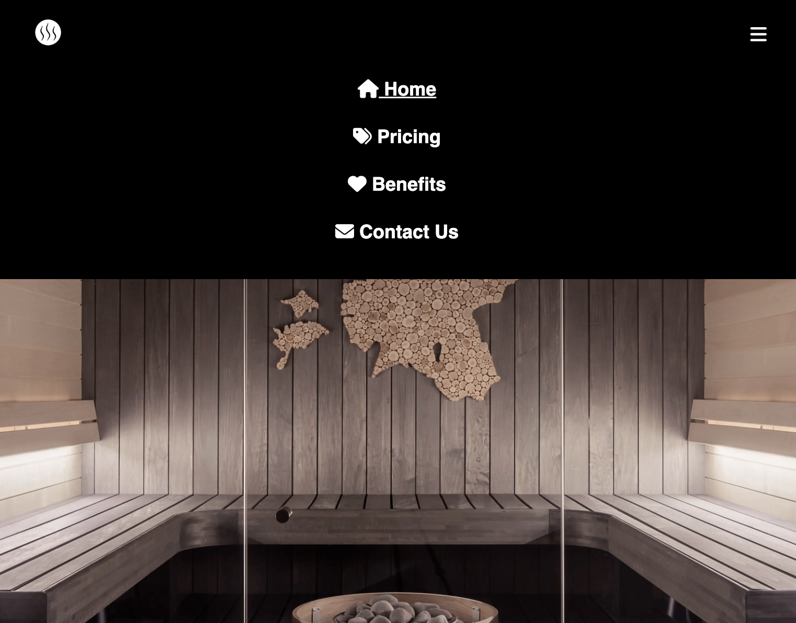

#### Navigation Link Underline and Page Identification

As a user navigating through different pages, I want a clear visual indication of the current page I am on, despite the similar parallax banner across pages.

This visual cue should help users easily identify which page they are currently viewing, especially since the parallax banner is similar across different pages.

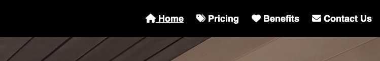

#### Video Display and Interaction on Pricing Page

As a potential customer interested in sauna details, I want to view videos showcasing the interior and exterior of the saunas on the pricing page, to better understand what I might be purchasing.

Video quality should be high, providing clear views of both the interior and exterior of the saunas.

Controls for the videos should be functional and user-friendly.

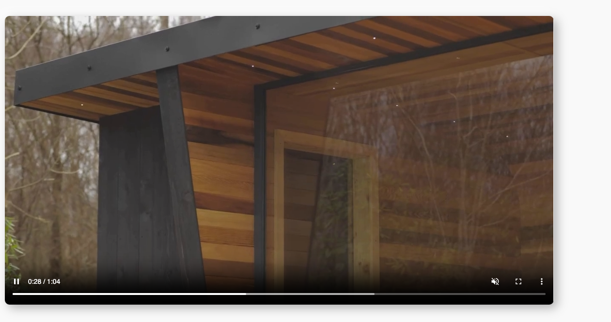

#### Responsive Pricing Cards and Interaction

As a user exploring sauna options, I want to view responsive pricing cards that provide clear pricing information and lead me to a sign-up form.

On hover, each card should scale up slightly, indicating interactivity.

Each card should clearly display the price and have a call-to-action button or link leading to the sign-up form.

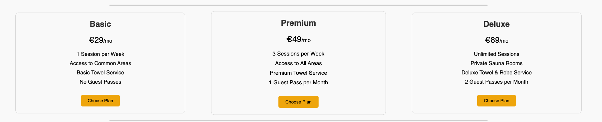

#### Form Usability and Functionality

As a potential customer interested in sauna subscriptions, I want to easily fill out and submit the contact form to inquire or sign up for services.

Interact with each field in the form, including entering text in text fields, selecting options from dropdown menus, and writing in the text area.

Submit the form to test its functionality and response.

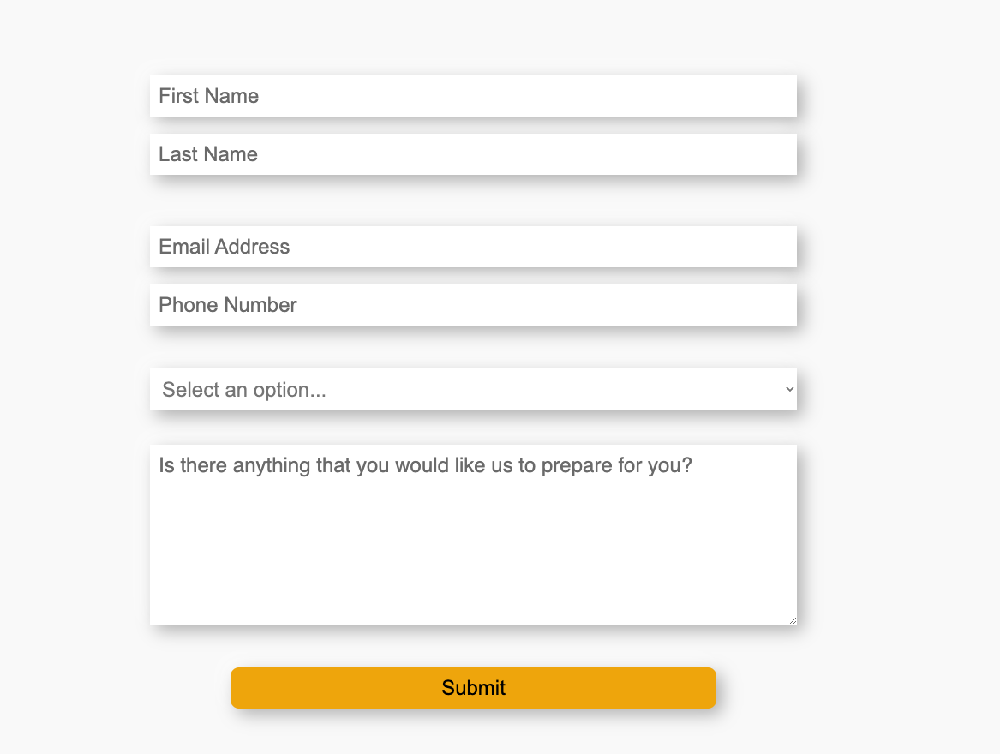

#### 404 Error Handling and Redirection

As a user who encounters a 404 error page, I want to be informed that the page I'm looking for doesn't exist and be redirected back to a relevant page, either automatically or through a manual option.

The 404 page should clearly inform that the requested page is not found.

The design of the 404 page should be consistent with the website's branding and not disrupt the user experience.

An automatic redirect should take the user back to the homepage or another relevant page after 10 seconds.

The page should also include a manual redirect button (e.g., "Return to Home") for users who prefer not to wait for the automatic redirect.

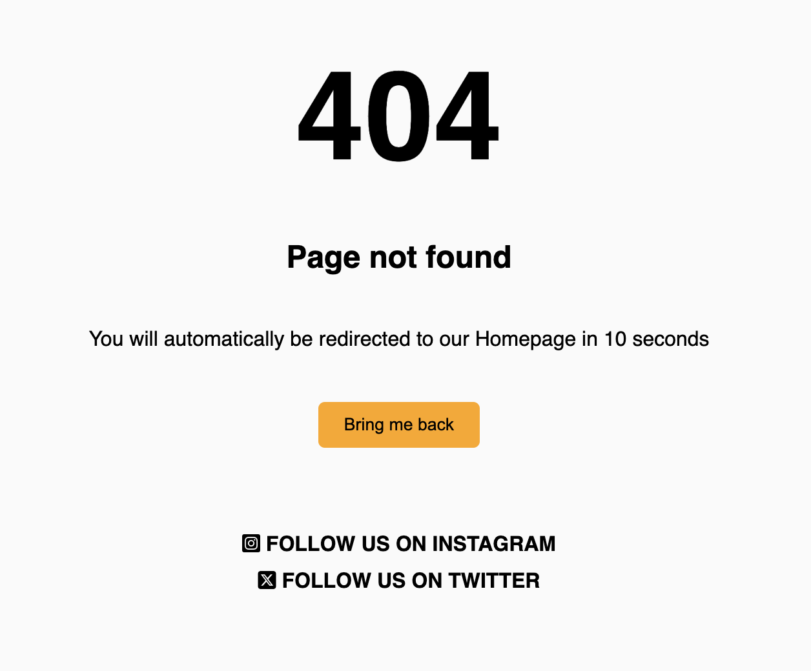
## Credits

#### Code used
[Responsive navigation bar](https://www.youtube.com/watch?v=qzAAiKFfNLo)
[Pricing cards](https://chat.openai.com/)
